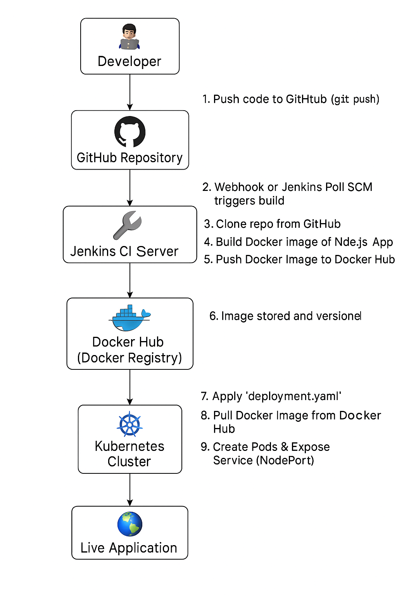

# 🚀 CI/CD Pipeline for Dockerized Node.js Application Deployment on Kubernetes using Jenkins


 
This project sets up a fully automated CI/CD pipeline that builds a Dockerized Node.js application, pushes it to Docker Hub, and deploys it on a Kubernetes cluster using Jenkins.
 
---
 
## 🧱 Prerequisites
 
- 2 EC2 Instances (Ubuntu 22.04 LTS) — 1 Master, 1 Worker
- Docker Installed
- Jenkins Running in Docker
- GitHub Repository for your Node.js app
- Docker Hub Account
 
---
 
## 🔧 Step-by-Step Setup
### 📌 Step 1: Update System
```bash
sudo apt update -y
```
 
### ☸️ Step 2: Configure Kubernetes Master
#### 1. Create setup script:
```sh
nano master.sh
```
 
#### 2. Paste the following into master.sh:
```sh
#!/bin/bash
set -e
 
echo "[Step 1] Load Kernel Modules..."
cat <<EOF | sudo tee /etc/modules-load.d/containerd.conf
overlay
br_netfilter
EOF
 
sudo modprobe overlay
sudo modprobe br_netfilter
 
echo "[Step 2] Set Sysctl Parameters for Kubernetes Networking..."
cat <<EOF | sudo tee /etc/sysctl.d/kubernetes.conf
net.bridge.bridge-nf-call-ip6tables = 1
net.bridge.bridge-nf-call-iptables = 1
net.ipv4.ip_forward = 1
EOF
 
sudo sysctl --system
 
echo "[Step 3] Install Required Packages..."
sudo apt update -y
sudo apt install -y apt-transport-https ca-certificates curl gpg
 
echo "[Step 4] Add Kubernetes APT Repository..."
sudo mkdir -p /etc/apt/keyrings
curl -fsSL https://pkgs.k8s.io/core:/stable:/v1.28/deb/Release.key | \
  sudo gpg --dearmor -o /etc/apt/keyrings/kubernetes-apt-keyring.gpg
 
echo "deb [signed-by=/etc/apt/keyrings/kubernetes-apt-keyring.gpg] \
https://pkgs.k8s.io/core:/stable:/v1.28/deb/ /" | \
  sudo tee /etc/apt/sources.list.d/kubernetes.list > /dev/null
 
sudo apt update
 
echo "[Step 5] Install Kubernetes Components..."
sudo apt install -y kubelet kubeadm kubectl
sudo apt-mark hold kubelet kubeadm kubectl
 
echo "[Step 6] Install and Configure containerd..."
sudo apt install -y containerd
sudo mkdir -p /etc/containerd
containerd config default | sudo tee /etc/containerd/config.toml
sudo sed -i 's/SystemdCgroup = false/SystemdCgroup = true/' /etc/containerd/config.toml
 
sudo systemctl restart containerd
sudo systemctl enable containerd
 
echo "[Step 7] Initialize Kubernetes Cluster..."
sudo kubeadm init --pod-network-cidr=192.168.0.0/16
 
echo "[Step 8] Configure kubectl for Regular User..."
mkdir -p $HOME/.kube
sudo cp -i /etc/kubernetes/admin.conf $HOME/.kube/config
sudo chown $(id -u):$(id -g) $HOME/.kube/config
 
echo "[Step 9] Install Calico CNI Plugin..."
kubectl apply -f https://raw.githubusercontent.com/projectcalico/calico/v3.27.0/manifests/calico.yaml
 
echo "[Step 10] Show Node Status..."
kubectl get nodes
 
echo "✅ Kubernetes Master Setup Completed!"
```
 
#### 3. Make script executable and run:
```sh
chmod +x master.sh
sudo ./master.sh
```
 
### ⚙️ Step 3: Setup Kubernetes Worker
#### 1. Create setup script:
```sh
nano worker.sh
```
 
#### 2. Paste the following into worker.sh:
```sh
#!/bin/bash
set -e
 
echo "[Step 1] Load Kernel Modules..."
cat <<EOF | sudo tee /etc/modules-load.d/containerd.conf
overlay
br_netfilter
EOF
 
sudo modprobe overlay
sudo modprobe br_netfilter
 
echo "[Step 2] Set Sysctl Parameters..."
cat <<EOF | sudo tee /etc/sysctl.d/kubernetes.conf
net.bridge.bridge-nf-call-ip6tables = 1
net.bridge.bridge-nf-call-iptables = 1
net.ipv4.ip_forward = 1
EOF
 
sudo sysctl --system
 
echo "[Step 3] Install Required Packages..."
sudo apt update -y
sudo apt install -y apt-transport-https ca-certificates curl gpg
 
echo "[Step 4] Add Kubernetes Repository..."
sudo mkdir -p /etc/apt/keyrings
curl -fsSL https://pkgs.k8s.io/core:/stable:/v1.28/deb/Release.key | \
  sudo gpg --dearmor -o /etc/apt/keyrings/kubernetes-apt-keyring.gpg
 
echo "deb [signed-by=/etc/apt/keyrings/kubernetes-apt-keyring.gpg] \
https://pkgs.k8s.io/core:/stable:/v1.28/deb/ /" | \
  sudo tee /etc/apt/sources.list.d/kubernetes.list > /dev/null
 
sudo apt-get update
 
echo "[Step 5] Install Kubernetes Tools..."
sudo apt-get install -y kubelet kubeadm kubectl
sudo apt-mark hold kubelet kubeadm kubectl
 
echo "[Step 6] Install and Configure containerd..."
sudo apt install -y containerd
sudo mkdir -p /etc/containerd
containerd config default | sudo tee /etc/containerd/config.toml
sudo sed -i 's/SystemdCgroup = false/SystemdCgroup = true/' /etc/containerd/config.toml
 
sudo systemctl restart containerd
sudo systemctl enable containerd
 
echo "[INFO] Worker node setup complete. Now join this node to the cluster using the kubeadm join command from the master node."
```
 
#### 3. Make script executable and run:
```sh
chmod +x worker.sh
sudo ./worker.sh
```
 
#### 4. On the Master Node, verify the node joined:
```bash
kubectl get nodes 
```
 
### 🐳 Step 4: Run Jenkins in Docker
---
 
#### 1. Install Docker
 
```bash
sudo apt install docker.io -y
```
#### 2. Run Jenkins Container
```bash
docker run -u 0 --privileged --name jenkins -it -d \
-p 8080:8080 -p 50000:50000 \
-v /var/run/docker.sock:/var/run/docker.sock \
-v $(which docker):/usr/bin/docker \
-v /home/jenkins_home:/var/jenkins_home \
jenkins/jenkins:latest
```
 
#### 3. Get the initial admin password:
```bash
docker exec -it jenkins cat /var/jenkins_home/secrets/initialAdminPassword
```
 
#### 4. Access Jenkins at:
```
http://<Your-Public-IP>:8080
```
 
### 🔌 Step 5: Configure Jenkins
 
#### 1. Install Required Plugins
 
In Jenkins UI:
 
- Go to **Manage Jenkins** → **Manage Plugins**
- Under the **Available** tab, search and install:
  - Pipeline: Stage View
  - Docker Pipeline
   - Kubernetes CLI Plugin  
    *(Upload .hpi manually if offline)*
 
---
 
#### 2. Add Credentials in Jenkins
 
Go to **Manage Jenkins** → **Credentials** → **(Global)** → **Add Credentials**
 
##### ➤ DockerHub Credentials
 
- **Kind**: Username with password  
- **ID**: `dockerlogin`  
- **Username**: _your Docker Hub username_  
- **Password**: _your Docker Hub password_  
- **Description**: `dockerlogin`
 
##### ➤ Kubernetes Configuration
 
- **Kind**: Kubernetes configuration (kubeconfig)  
- **ID**: `kubernetes`  
- **Description**: `kubernetes`  
- **Enter content directly**:
  Run this command on your master node:
  ```bash
  cat ~/.kube/config
  ```
 
### 🔐 Step 6: Generate API Token in Jenkins & Setup GitHub Webhook
 
---
 
#### 1. Generate Jenkins API Token
 
- Go to **Jenkins Dashboard**
- Click on your **Username** (top right)
- Navigate to **Configure → API Token → Add New Token**
- Enter a **token name**, then click **Generate**
- **Copy and save** the generated token securely — it will be used in GitHub webhook
 
---
 
#### 2. Configure GitHub Webhook
 
- Open your **GitHub Repository**
- Go to **Settings → Webhooks**
- Click **Add Webhook**
 
Fill in the details:
 
- **Payload URL**:  
URL: http://<Jenkins-IP>:8080/github-webhook/
 
- **Content type**:  
application/json
 
- **Secret**:  
Paste the **Jenkins API Token** you generated earlier
 
- Click **Add Webhook**
---
 
🔁 Step 6: Create Jenkins Pipeline Job
Go to Jenkins → New Item → Pipeline
Use the following pipeline script:
 
```groovy
pipeline {
  environment {
    dockerimagename = "yourdockerhub/nodeapp"
    dockerImage = ""
  }
 
  agent any
 
  stages {
 
    stage('Checkout Source') {
      steps {
        git 'https://github.com/your/repo.git'
      }
    }
 
    stage('Build Docker Image') {
      steps {
        script {
          dockerImage = docker.build(dockerimagename)
        }
      }
    }
 
    stage('Push to DockerHub') {
      environment {
        registryCredential = 'dockerlogin'
      }
      steps {
        script {
          docker.withRegistry('https://registry.hub.docker.com', registryCredential) {
            dockerImage.push("latest")
          }
        }
      }
    }
 
    stage('Deploy to Kubernetes') {
      steps {
        script {
          kubernetesDeploy(configs: "deploymentservice.yml", kubeconfigId: "kubernetes")
        }
      }
    }
 
  }
}
```
 
#### Save & click Build Now
 
#### Verify Kubernetes Service
```
kubectl get svc
```
 
### 🌐 Step 7: Access the App
```
http://<Node-IP>:<NodePort>
```
### ✅ Final Output: Application Response

